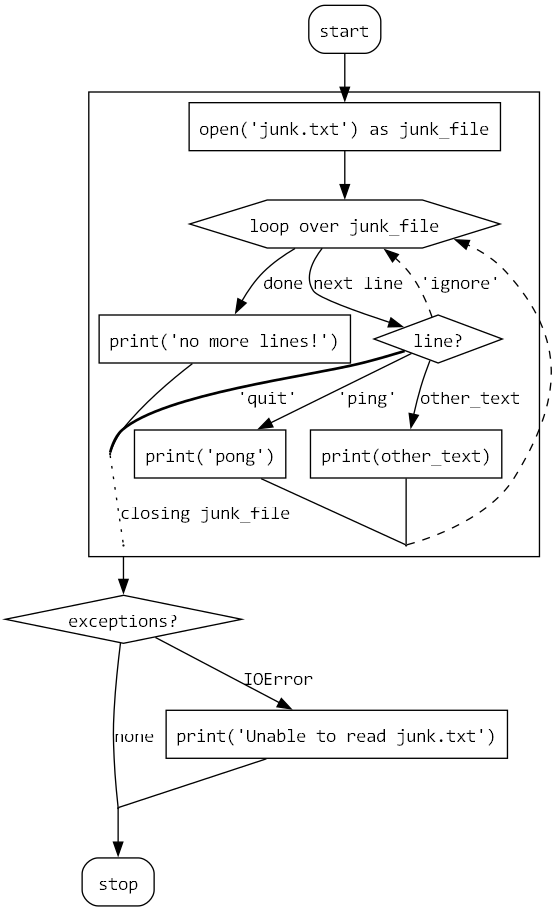

Quick and dirty experiment (proof of concept) to create flowcharts from pythoncode.
It requires pydot and graphviz to be installed.

## Quick demo

```python
def fizzbuzz():
    for num in range(100):
        if num % 3 == 0 and num % 5 == 0:
            print("FizzBuzz")
        elif num % 3 == 0:
            print("Fizz")
        elif num % 5 == 0:
            print("Buzz")
        else:
            print(num)
```

is converted to a flowchart in graphviz.
The result looks like this:


Here is a crazier example:

```python
def read_junk():
    try:
        with open("junk.txt") as junk_file:
            for line in junk_file:
                match line:
                    case "ping":
                        print("pong")
                    case "quit":
                        break
                    case "ignore":
                        continue
                    case other_text:
                        print(other_text)
            else:
                print("no more lines!")
    except IOError:
        print("Unable to read junk.txt")
```



## TODO

- [x] if/else/elsif
- [x] match
    - [ ] match guard
- [x] Loops
    - [x] for
        - [x] basic
        - [x] for/else
    - [x] while
      - [x] basic
      - [x] while/else
      - [x] Special-case `while True:`
    - [x] break
    - [x] continue
- [x] return
- [x] raise
    - [x] externally
    - [ ] internally (not really supported, I guess)
- [x] try/except
- [x] with block
- [ ] Nested functions (maybe display them in a subgraph?)

## Ideas

Consider building on plantuml instead of graphviz directly.
Page 64 of https://pdf.plantuml.net/1.2020.22/PlantUML_Language_Reference_Guide_en.pdf

## Similar projects

- https://github.com/cdfmlr/pyflowchart
