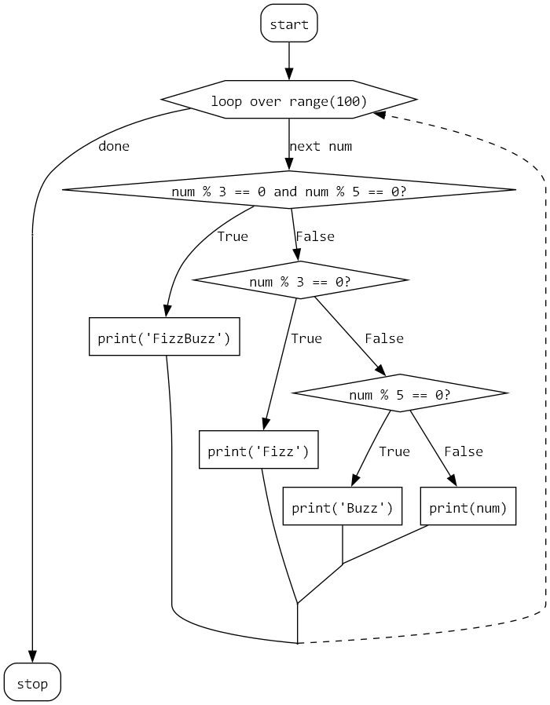

Quick and dirty experiment (proof of concept) to create flowcharts from pythoncode.
It requires pydot and graphviz to be installed.

## Quick demo

```python
def fizzbuzz2():
    for i in range(100):
        if i % 3 == 0 and i % 5 == 0:
            print("FizzBuzz")
        elif i % 3 == 0:
            print("Fizz")
        elif i % 5 == 0:
            print("Buzz")
        else:
            print(i)
```

is converted to a flowchart in graphviz.
The result looks like this:



Here is a crazier example:

```python

def read_junk(lines):
    try:
        with open("junk.txt") as fp:
            for line in fp.readlines():
                if line == "q":
                    break
                elif line == "c":
                    continue
                else:
                    print(line)
            else:
                print("no more lines!")
    except IOError:
        print("Unable to read junk")
```


## TODO

- [x] if/else/elsif
- [x] match
    - [ ] match guard
- [x] Loops
    - [x] for
        - [x] basic
        - [x] for/else
    - [x] while
      - [x] basic
      - [x] while/else
      - [x] Special-case `while True:`
    - [x] break
    - [x] continue
- [x] return
- [x] raise
    - [x] externally
    - [ ] internally (not really supported, I guess)
- [x] try/except
- [x] with block
- [ ] Nested functions (maybe display them in a subgraph?)

## Ideas

Consider building on plantuml instead of graphviz directly.
Page 64 of https://pdf.plantuml.net/1.2020.22/PlantUML_Language_Reference_Guide_en.pdf

## Similar projects

- https://github.com/cdfmlr/pyflowchart
